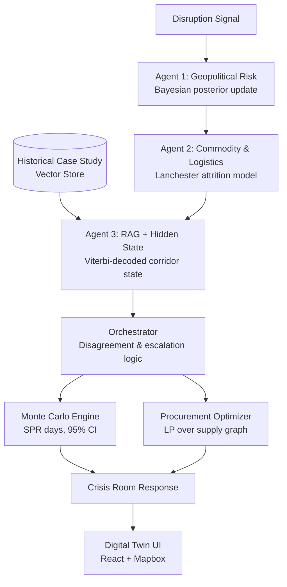

# energy-twin-ai

**An agentic digital twin of India's crude oil supply chain — built for ET AI Hackathon 2026 (Challenge 2: AI-Driven Energy Supply Chain Resilience for Import-Dependent Economies).**

Feed it a real-world disruption signal — a drone strike near the Strait of Hormuz, a sanctions announcement, an insurance-premium spike — and it reasons about it the way a crisis-response desk would: how much to believe the threat, how fast usable shipping capacity erodes under it, whether this has happened before and what happened last time, how many days of strategic reserve that buys the country, and where to reroute procurement instead.

## Why this exists

India sources roughly 88% of its crude oil from imports, with 40–45% transiting the Strait of Hormuz, and holds only a matter of days of Strategic Petroleum Reserve cover. Traditional supply-chain planning tools have no way to model geopolitical scenario impacts in real time — they're built for predictable environments, not for a Hormuz closure or a Red Sea shipping suspension. This project replaces a single opaque "risk score" with a set of cooperating agents, each grounded in a named, citable mathematical model, so the reasoning behind every recommendation is traceable and defensible, not a black box.

## What it does

- **Assesses geopolitical risk** for a supply corridor using a Bayesian posterior update over classified threat signals.
- **Models shipping-capacity erosion** under sustained threat pressure with a Lanchester attrition equation, including a market-recovery term.
- **Retrieves historical analogues** — cited real-world disruptions (the 2023 Houthi Red Sea escalation, the 2025 US–Iran standoff) — and infers the corridor's hidden threat state via a hand-implemented Hidden Markov Model.
- **Flags agent disagreement explicitly.** When the geopolitical signal and the logistics signal disagree — calm news but alarming shipping data, or vice versa — the system escalates to a human analyst instead of silently averaging conflicting evidence.
- **Runs Monte Carlo simulations** (10,000 iterations) to project Strategic Petroleum Reserve days-of-cover with a 95% confidence interval.
- **Recommends procurement alternatives** via a linear-programming optimizer over the live supply-chain graph, factoring routing cost and corridor risk.
- **Visualizes all of this live** on an interactive digital-twin map, with a real-time reasoning panel showing exactly which evidence and which model produced each recommendation.

## Architecture



## Tech stack

| Layer | Technology |
|---|---|
| Backend | Python, FastAPI, SciPy (ODE solving), NetworkX (supply-chain graph), PuLP/CBC (procurement optimization) |
| Intelligence | Chroma + sentence-transformers (RAG vector store), NumPy (Monte Carlo sampling), a hand-implemented Viterbi decoder (HMM) |
| Frontend | React, Vite, Tailwind CSS, Mapbox GL / react-map-gl, Recharts |
| Data | A curated supply-chain graph covering major crude suppliers, maritime corridors, Indian ports, and refineries; a cited set of historical disruption case studies |

## Quickstart

### Backend

```bash
cd backend
python3 -m venv venv
source venv/bin/activate          # Windows: venv\Scripts\activate
pip install -r requirements.txt
cp ../.env.example .env
uvicorn main:app --reload --port 8000
```

Verify it's running:

```bash
curl http://localhost:8000/api/health
```

> [!NOTE]
> The RAG layer downloads a sentence-transformer embedding model from Hugging Face on first run. An internet connection is required for that first launch; the model is cached locally afterward.

### Frontend

```bash
cd frontend
npm install
cp .env.example .env.local        # add your Mapbox token as VITE_MAPBOX_TOKEN
npm run dev
```

Open `http://localhost:5173`. Trigger a disruption scenario from the incident feed and watch the reasoning pipeline execute live — Bayesian update, Lanchester simulation, historical retrieval, Monte Carlo projection, and reroute recommendation — each shown on the digital twin as it completes.

## Project structure

```
backend/
  agents/          Geopolitical, Commodity/Logistics, RAG+HMM, and SPR agents
  graph/           Supply-chain graph loading, snapshotting, and reroute search
  rag/             Vector store + retriever for historical case-study evidence
  simulations/     Monte Carlo engine and scenario impact modeling
  optimization/    Linear-programming procurement optimizer
  services/        Orchestrator — coordinates every agent into one response
  supply_math/     Core mathematical primitives (Bayesian update, etc.)
  models/          Shared schemas and enums
  data/            The canonical supply-chain graph dataset
  main.py          FastAPI application entrypoint
frontend/
  src/components/  Digital twin map, incident feed, reasoning/analysis panels
  src/context/     Application state and simulation data flow
  src/services/    API client
```

## Grounding

Every mathematical model used here is tied to a real, citable source — Bayesian inference for threat classification, Lanchester's Square Law for attrition modeling, Hidden Markov Models for latent-state sequence inference, Monte Carlo methods for supply-chain disruption risk, and IEA/IMF elasticity figures for downstream macroeconomic impact estimates. The goal throughout has been a system whose reasoning can be checked, not just trusted.

## Team

Built by Mirun, Sudarshan, and Narendra for ET AI Hackathon 2026.

## License

Submitted for ET AI Hackathon 2026. Licensing to be finalized post-submission.
